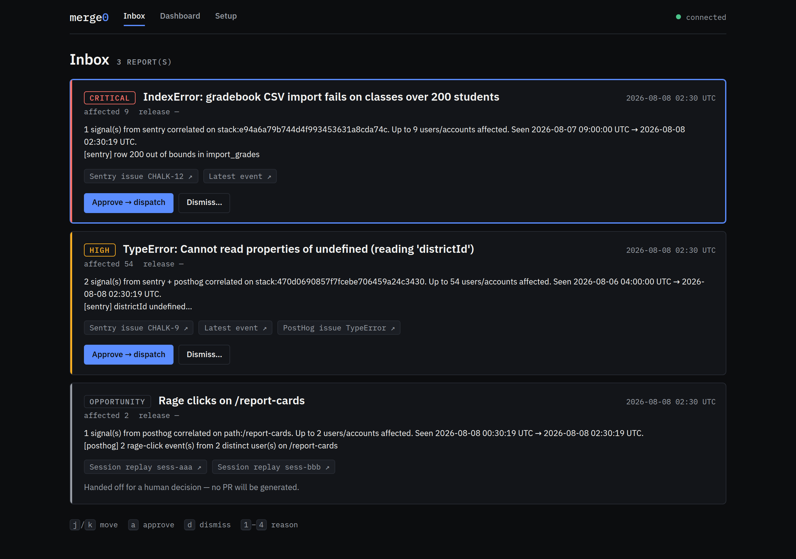
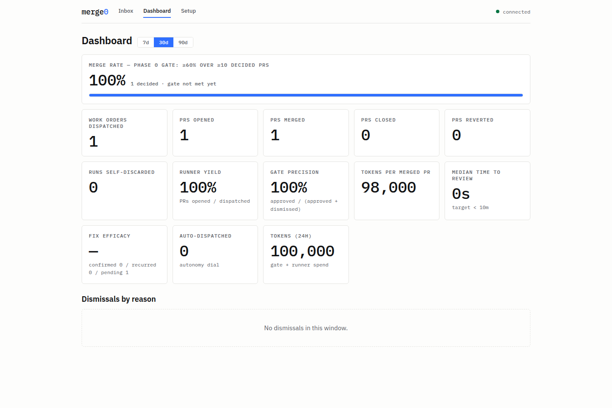
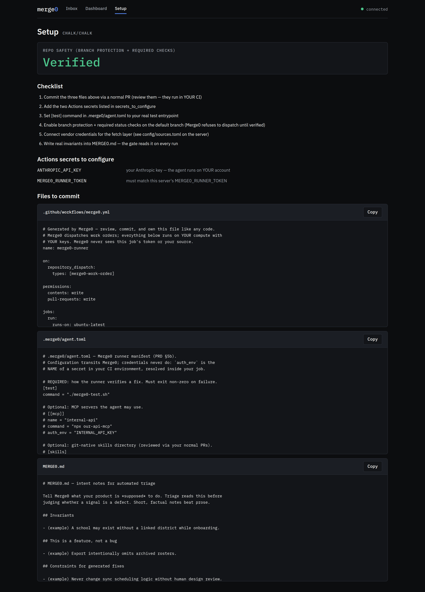

# Merge0

**The self-driving product loop.** Merge0 ingests the signals your team
already collects — crashes, rage clicks, support tickets, monitors —
normalizes them into one schema, triages them into evidence-backed work
orders, and turns the approved ones into small, test-passing pull requests
using **your own coding agent on your own compute**. A human merges every
change. No red PRs, no auto-merge, ever.

> **Status: public preview, pre-1.0.** Everything here works and is
> tested (the eval numbers below are measured, not aspirational), but the
> honest milestone that matters is still ahead: the Phase 0 gate of ≥60%
> merge rate across ≥10 decided PRs on a real repo (`docs/PRD.md`). Watch
> the dashboard, kick the tires, open issues — adapters are the most
> wanted contribution.

**Website:** [hkd987.github.io/Merge0](https://hkd987.github.io/Merge0/) —
screenshots, an animated tour of the loop, and the four-step quickstart.



## How the loop works

```
┌───────────┐   ┌───────────────┐   ┌─────────┐   ┌──────────┐   ┌────────┐
│ Adapters  │──▶│ Context Store │──▶│ Triage  │──▶│  Runner  │──▶│ Inbox  │
│ (ingest)  │   │ (assembly)    │   │ (scouts │   │ (BYO     │   │ (+Slack│
│           │   │               │   │ + gate) │   │  agent)  │   │ digest)│
└───────────┘   └───────────────┘   └─────────┘   └──────────┘   └────────┘
                        ▲                                            │
                        └────────────── outcome memory ◀─────────────┘
```

1. **Ingest.** The fetch layer polls your tools (or receives their native
   webhooks) and adapters normalize every payload into a common `Signal`
   schema (`docs/signal-schema.md`) with deep links back to the source.
2. **Triage.** Config-driven scouts select candidates; deterministic
   clustering merges the same defect across sources into one report; a
   model gate — reading your repo's own `MERGE0.md` intent doc and the
   outcome history — emits either a Work Order with testable success
   criteria or a SKIP with a reason. Never silence.
3. **Review.** You approve or dismiss in a keyboard-first inbox (or from
   Slack). Dismissal reasons feed outcome memory; "intended behavior"
   reroutes future recurrences away from code changes entirely.
4. **Run.** Approval dispatches to a generated GitHub Actions workflow in
   *your* repo: your agent (Claude Code by default), your API key, your
   test suite as the bar. The run self-repairs within budget or
   self-discards with a diagnosis — a failing PR never reaches review.
   Diff budgets (≤4 files / ≤150 lines by default) are enforced
   server-side.
5. **Learn.** Merges, closes, and reverts are captured by webhook into
   outcome memory and the telemetry dashboard. Optional flags add a
   post-merge hardening pass (prevention PRs) and a weekly meta-loop that
   proposes tuning to Merge0's own prompts — as ordinary PRs.

## What's inside

- **Signal sources**: errors and product signals — PostHog (error
  tracking, rage/dead clicks, funnel drop-offs), Sentry, Datadog,
  LoopForge, OTel logs, **Mixpanel** (saved-funnel drop-offs via the
  Query API), **OpenPanel** (your named error events via the export
  API); social feedback — **Reddit** (new posts from subreddits you own
  or watch) and **X** (mentions of your handle or watched hashtags), both
  triaged like any other user report; everywhere work gets written down —
  Zendesk, Intercom, GitHub Issues, **Jira, Linear, Asana, Trello, and
  designated Slack channels** (all `ticket` signals feeding the
  ticket-triage scout); plus a generic webhook envelope for anything
  else. Pollers + native signature-verified webhooks per vendor.
- **Ticket delegation**: put a `merge0` label on a Jira or Linear issue
  and it fast-tracks — flagged `delegated` (schema v0.4), severity
  floored at High, picked up by an hourly scout, and first in line at
  the gate. Safety checks are never bypassed.
- **Story or PR delivery**: approval can file an evidence-backed **Jira
  story** instead of opening a PR (`MERGE0_DELIVERY_MODE=story`) — the same
  gated Work Order, delivered where planning already happens, for teams not
  yet ready for autonomous code. `story_and_pr` files the story *and*
  dispatches. Stories are stamped `merge0-generated` so ingesting the same
  Jira never re-triages Merge0's own output.
- **Confidence-scored gate + autonomy dial**: every Work Order carries
  the gate's self-assessed confidence (`low`/`medium`/`high`,
  fail-conservative parsing). Auto-dispatch of high-confidence orders
  exists but **ships off** (`[autonomy]` in `config/gate.toml`); every
  dispatch records its actor (`human`/`slack`/`auto`) for audit. And the
  confidence *acts*: below `[delivery] min_confidence_for_pr` a Work Order
  is filed as a story for a human instead of sent to an agent, so a
  borderline judgment produces a queued ticket rather than a gambled PR.
- **CODEOWNERS routing**: the file paths a report's evidence mentions
  (stack traces, work-order repro) are matched against your repo's
  CODEOWNERS — GitHub's exact last-match-wins semantics — and the owning
  teams appear on the report detail, so triage lands in front of the
  right humans without anyone reading the trace first.
- **Close-the-loop telemetry**: after a PR merges, Merge0 watches
  whether the originating signals actually stop — fixes are
  `pending`/`confirmed`/`recurred` and the fix-efficacy rate rides the
  dashboard, `/telemetry`, and `/metrics`.
- **Cost caps**: an optional hard token budget per rolling 24h
  (`[budget]` in `config/gate.toml`); exceeded → the gate pauses,
  candidates stay pending, a Slack warning fires once per window.
- **Escalation re-open**: dismissed reports return to the inbox when
  their impact multiplies past `MERGE0_REOPEN_FACTOR` (default 3×) or a
  member ticket gets delegated — with the prior dismissal noted.
  `intended_behavior` dismissals stay closed.
- **Web app** (React SPA embedded in the single binary, styling contract
  in `docs/style-guide.md`): `/inbox` review queue, `/reports/{id}`
  detail (confidence, dispatch actor, fix efficacy), `/dashboard`
  acceptance telemetry vs the Phase 0 gate, `/setup` onboarding bundle.
- **Slack**: new-report and PR-ready notifications (killable per class
  via `MERGE0_SLACK_NOTIFY`), weekly digest, interactive Approve/Dismiss
  buttons.
- **Extension surfaces** (P2 previews): `POST /broker/credentials` —
  single-use, repo-scoped, Work-Order-gated runner credentials; `GET
  /registry/skills` + install — a signature-verified curated skill
  registry whose installs land as reviewable manifest-change PRs.
- **Security posture**: GitHub App installation tokens only (no PATs),
  bearer auth on every product route, per-IP rate limiting on open
  endpoints, webhook signature verification (GitHub HMAC, Sentry,
  Zendesk, vendor tokens), work-order sanitization (no raw payloads or
  credential markers leave the server), egress allowlisting in the
  runner workflow, branch-protection verification before any dispatch,
  and configurable raw-payload retention.
- **Evals** (`evals/`): the model judgments are measured, not assumed —
  a 30-scenario gate corpus (hand-built controls, 13 real-world
  GitHub-issue archetypes, and memory-retrieval canaries, with borderline
  cases scored as pass rates over repeated runs) and six seeded-bug agent
  fixtures, all run against a real model. Current baseline: 100% gate
  decision accuracy with zero secret leaks, 5/5 agent fixes with the
  policy-violation refusal held, and changes to what the gate sees are
  measured as A/Bs against reconstructed prior behavior
  (`evals/BASELINE.md`).
- **Commercial layer** (`ee/`, non-MIT): multi-tenant control plane —
  tenant lifecycle, RBAC, audit log, usage metering, cross-tenant priors.



## Try the triage in two minutes (no server, no database)

Point the one-shot CLI at a vendor export and watch the same adapters,
clustering, and gate the full loop runs decide what deserves work — using
the Claude Code CLI you already have as the model, so your existing login
is the only credential involved:

```sh
# A Sentry issues export (the API's JSON array, verbatim) — or any
# source via its adapter envelope shape:
cargo run -p merge0-server --bin merge0 -- \
  triage --source sentry --file issues.json
```

Each cluster prints its evidence-backed verdict: a Work Order (summary,
repro, testable success criteria, confidence) or a SKIP with the reason.
`--json` for machine output, `--help` for the full flag list. When the
verdicts look right, the sections below wire the same judgment into the
full loop — inbox, agents, PRs, outcome memory.

## Quick start (Docker)

```sh
cp .env.example .env    # fill in tokens + GitHub App credentials
docker compose up --build
# or run the published image (tagged releases; see CHANGELOG.md):
#   docker pull ghcr.io/hkd987/merge0:latest
```

Or deploy without a server of your own —
[](https://render.com/deploy?repo=https://github.com/hkd987/Merge0)
— plus Railway (template) and Fly.io (`fly launch --from`) paths in
**[docs/one-click-deploy.md](docs/one-click-deploy.md)**.

First time? Merge0 authenticates as a **GitHub App** (never a PAT), which
you create once — about five minutes, walked through step by step with
the exact permissions and events in
**[docs/github-app-setup.md](docs/github-app-setup.md)**. To look around
first without creating anything, `MERGE0_DEV_FAKES=1 docker compose up
--build` runs the whole loop against in-process fakes.

Then open `http://127.0.0.1:8080/setup`: it serves the three files to
commit to your product repo (the runner workflow, `MERGE0.md` intent doc,
`.merge0/agent.toml` manifest), the two Actions secrets to configure, and
a live branch-protection check — Merge0 refuses to dispatch until
protection is verified.



Deploying for real: the multi-stage `Dockerfile` builds UI + server pinned
to the CI toolchain (behind a TLS-inspecting proxy pass the CA with
`docker build --secret id=extra_ca_certs,src=proxy-ca.pem .`). On Coolify,
create a Docker Compose service from this repo and set the `.env` values
in the UI; `MERGE0_PUBLIC_URL` must match the public HTTPS URL that GitHub
and your vendors call back to. All durable state is in Postgres — snapshot
the `pgdata` volume or cron a `pg_dump`; the server itself is stateless.
The hosted control plane (`merge0-hosted`, in the image) is a separate
binary for multi-tenant installs only.

## Configuration

Vendor pollers are enabled per-source in `config/sources.toml` (API
credentials referenced by env-var *name*); scout/gate prompts and budgets
live in `config/` as reviewed files. Server environment:

| Variable | Required | Purpose |
|---|---|---|
| `MERGE0_DATABASE_URL` | ✅ | Postgres connection string |
| `MERGE0_REPO` | ✅ | Target repo `owner/name` (validated at boot) |
| `MERGE0_API_TOKEN` | ✅* | Bearer token for the API + app |
| `MERGE0_RUNNER_TOKEN` | ✅* | Token the runner callback authenticates with |
| `MERGE0_GITHUB_WEBHOOK_SECRET` | ✅* | HMAC secret for `/webhooks/github` |
| `MERGE0_GITHUB_APP_ID` / `MERGE0_GITHUB_APP_PRIVATE_KEY` / `MERGE0_GITHUB_INSTALLATION_ID` | ✅ | GitHub App auth (installation tokens only) |
| `ANTHROPIC_API_KEY` | ✅ | Model key for the triage gate (BYO) |
| `MERGE0_GATE_MODEL` | — | Gate model id (default `claude-sonnet-5`) |
| `MERGE0_AGENT` | — | Runner agent: `claude-code` (default), `codex-cli`, `gemini-cli`, `aider`, `opencode`, `cursor-cli`, `custom:<cmd>` — see “Bring your own agent” |
| `MERGE0_TENANT` | — | Postgres schema name (default `default`) |
| `MERGE0_PUBLIC_URL` | — | Public base URL (Slack links, defaults callbacks) |
| `MERGE0_CALLBACK_URL` | — | Explicit runner-callback URL override |
| `MERGE0_BIND` | — | Listen address (default `127.0.0.1:8080`; containers set `0.0.0.0:8080`) |
| `MERGE0_CONFIG_DIR` | — | Config directory (default `config`) |
| `MERGE0_TRIAGE_INTERVAL_SECS` | — | Fetch+triage cadence (default nightly; `0` disables) |
| `MERGE0_INTENT_FALLBACK` | — | Intent text used until `MERGE0.md` exists in the repo |
| `MERGE0_SLACK_WEBHOOK_URL` / `MERGE0_SLACK_SIGNING_SECRET` | — | Slack digest + interactive approvals |
| `MERGE0_SENTRY_WEBHOOK_SECRET`, `MERGE0_POSTHOG_WEBHOOK_TOKEN`, `MERGE0_ZENDESK_WEBHOOK_SECRET`, `MERGE0_DATADOG_WEBHOOK_TOKEN`, `MERGE0_JIRA_WEBHOOK_TOKEN`, `MERGE0_LINEAR_WEBHOOK_SECRET` | — | Native vendor webhook verification (per vendor you point at `/webhooks/{vendor}`; Slack Events reuse `MERGE0_SLACK_SIGNING_SECRET`) |
| `MERGE0_RATE_LIMIT_PER_SECOND` | — | Per-IP limit on open routes (default 10, burst 30; `0` disables) |
| `MERGE0_HARDENING_ENABLED` | — | `1` enables post-merge prevention PRs (§5c) |
| `MERGE0_META_ENABLED` | — | `1` enables the weekly meta-loop (§5d) |
| `MERGE0_RAW_RETENTION_DAYS` | — | Purge verbatim vendor payloads after N days |
| `MERGE0_DEV_FAKES` | — | `1` swaps model+GitHub for in-process fakes (dev only) |

\* Technically optional — the server runs open and warns loudly. Never in
production.

Hosted control plane (`merge0-hosted`): `MERGE0_DATABASE_URL`,
`MERGE0_EE_ADMIN_TOKEN`, `MERGE0_EE_BIND` (default `127.0.0.1:8090`).
Tests: `MERGE0_TEST_DATABASE_URL`. Evals: `MERGE0_EVAL_CLI`,
`MERGE0_EVAL_MODEL`, `MERGE0_EVAL_SCENARIOS`, `MERGE0_EVAL_RESULTS`.

## Bring your own agent

The runner is harness-agnostic: `MERGE0_AGENT` selects which coding agent
the generated workflow invokes, each in its documented headless mode with
the sanitized Work Order as the entire prompt. The agent runs in **your**
CI job with **your** provider key (never transiting Merge0); the
job-scoped token and the workflow's diff/repair budgets are the security
boundary regardless of harness.

| `MERGE0_AGENT` | Invocation | Actions secret(s) |
|---|---|---|
| `claude-code` (default) | `claude -p … --allowedTools <scoped>` | `ANTHROPIC_API_KEY` |
| `codex-cli` | `codex exec --sandbox workspace-write …` | `OPENAI_API_KEY` |
| `gemini-cli` | `gemini -p … --approval-mode=yolo` | `GEMINI_API_KEY` |
| `aider` | `aider --message … --yes-always --no-auto-commits` | `ANTHROPIC_API_KEY` or `OPENAI_API_KEY` |
| `opencode` | `opencode run …` | `ANTHROPIC_API_KEY` or `OPENAI_API_KEY` |
| `cursor-cli` | `cursor-agent -p …` | `CURSOR_API_KEY` |
| `custom:<cmd>` | your command; work order at `$MERGE0_WORK_ORDER` | whatever it needs (declare via the manifest's `auth_env`) |

Change `MERGE0_AGENT`, re-download the workflow from `/setup`, and commit
it — the egress allowlist, secret mappings, and invocation all follow the
selected harness. Notes: Claude Code is the only harness with per-tool
allowlisting, so the others rely on their own sandbox flags plus the job
boundary; aider runs with auto-commits disabled because the workflow owns
the commit and the diff measurement. Fixture-level quality per harness is
measurable with `scripts/agent-eval.sh --agent <label>` (requires that
CLI installed and authenticated; see `evals/README.md`).

## API surface

`/inbox`, `/dashboard`, `/setup` (the app — data-free static assets;
token entered once in the browser) · JSON: `GET /reports`,
`POST /reports/{id}/approve|dismiss`, `GET /telemetry`, `GET /metrics`
(Prometheus text), `GET /safety`, `GET /onboarding`, `POST /triage/run`,
`POST /ingest/{source}` (envelope), `GET /registry/skills`,
`POST /registry/skills/{name}/install` · self-authenticated:
`POST /webhooks/github`, `POST /webhooks/{sentry,posthog,zendesk,datadog,jira,linear,slack}`,
`POST /runner/callback`, `POST /broker/credentials`,
`POST /slack/interactions` · open: `GET /healthz`
(DB-backed). All product routes require
`Authorization: Bearer $MERGE0_API_TOKEN`.

## Development

~25-crate Rust workspace + a React UI. Layout highlights: `merge0-signal`
(the schema — spec changes update `docs/signal-schema.md` in the same PR),
`merge0-adapters` + `merge0-adapter-*` (golden-payload conformance,
`MERGE0_BLESS=1` regenerates), `merge0-store` (Postgres,
schema-per-tenant, versioned migrations), `merge0-triage` (scouts with
executed query filters → clustering → fail-closed gate), `merge0-fetch`
(vendor I/O), `merge0-runner` (workflow generation, sanitization,
budgets), `merge0-github` / `merge0-model` / `merge0-slack` (clients,
wiremock-tested), `merge0-hardening` / `merge0-meta` (the improvement
loops), `merge0-server` (Axum + embedded SPA), `merge0-evals`,
`merge0-e2e`, and `ee/`.

```sh
# Postgres for the integration tests (or set MERGE0_TEST_DATABASE_URL)
initdb -D .pg -U merge0 && pg_ctl -D .pg -o "-p 55432" start
createdb -h localhost -p 55432 -U merge0 merge0

# the four gates — all must pass before any commit (CI-enforced)
cd ui && npm ci && npm test && npm run build && cd ..
cargo build --workspace
cargo test --workspace
cargo fmt --all --check && cargo clippy --workspace --all-targets -- -D warnings
```

- **UI**: `cd ui && npm run dev` (Vite on :5173, API proxied to a local
  server running with `MERGE0_DEV_FAKES=1`). All styling flows from the
  tokens in `ui/src/theme.css` per `docs/style-guide.md` — a lint test
  fails the build on color literals anywhere else.
- **Manual e2e**: `scripts/e2e-manual.sh` drives the real binary over
  HTTP end to end (34 checks: ingest → triage → Slack-interaction
  approve → callback → merge webhook → telemetry, plus auth,
  idempotency, and signature negatives).
- **Model evals** (real model spend, never in CI):
  `cargo run -p merge0-evals --bin gate-eval` scores the gate against the
  scenario corpus; `scripts/agent-eval.sh` replays the runner workflow
  against seeded-bug fixtures. See `evals/README.md` and the measured
  baseline in `evals/BASELINE.md`.
- `CLAUDE.md` carries the architecture invariants (adapter isolation,
  schema-as-spec, no credentials anywhere, MIT/`ee` boundary, config-not-
  code prompts, tests-are-the-bar, the UI style contract) and a
  self-updating lessons log.

## Principles

- **BYO compute and keys.** Customer code never transits Merge0 servers;
  the runner executes in your CI with your credentials.
- **No auto-merge, ever.** A human clicks merge on every change.
- **No red PRs.** Self-repair within budget, then self-discard with the
  diagnosis salvaged onto the report.
- **Precision over recall.** A quiet inbox that's always right beats a
  busy inbox that's sometimes right; the gate fails closed.
- **Self-improvement lands in artifacts, never the executor.** Hardening
  and meta-loop changes arrive as evidence-linked, human-merged PRs.

## Contributing & security

`CONTRIBUTING.md` covers the four CI gates, the adapter contribution path,
and the CLA. Security reports go through GitHub private vulnerability
reporting — see `SECURITY.md`; the current threat model and review live in
`docs/security-review.md`.

## License

MIT (see `LICENSE`), except the `ee/` directory which is under a
commercial license (see `ee/LICENSE`).
